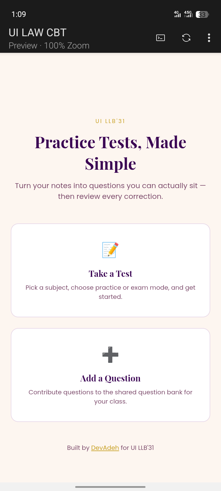

# UI LAW STUDY 

A computer-based test practice app for the UI LLB'31 class, built with HTML, CSS, JavaScript, and Firebase Firestore.

## Preview

## Links

Solution link: [https://github.com/DevAdeh/UI-LLB-CBT.git]

Live link: [https://ui-law.vercel.app/]

## Features
- Add questions to a shared question bank, organized by subject
- Practice Mode: instant feedback after each answer
- Exam Mode: corrections shown only at the end
- Score summary and full question-by-question review with explanations
- Questions shuffle each time for a fresh test order

## How it works
Questions are stored in Firebase Firestore, organized by subject. When starting a test, the app queries Firestore for only the questions matching the selected subject, shuffles them, and tracks the user's answers in a single state object as they progress. Results are temporarily saved with `sessionStorage` and read by the results page, which calculates the score and renders a full review — showing the user's answer, the correct answer, and the explanation for every question.

## Tech used
- HTML
- CSS
- JavaScript (Firestore queries, state management, sessionStorage)
- [Firebase Firestore](https://firebase.google.com/docs/firestore) (database)

## How to use
1. Clone or download this repo
2. Open `index.html`
3. Add a few questions via "Add a Question"
4. Take a test via "Take a Test" and review your results

## Project structure

ui-law-study/
├── index.html
├── import.html
├── take-test.html
├── results.html
├── firebase-config.js
├── import.js
├── take-test.js
├── results.js
├── style.css
├── favicon.ico
└── README.md

## Author
Adeola Ejikunle — [GitHub](https://github.com/DevAdeh)